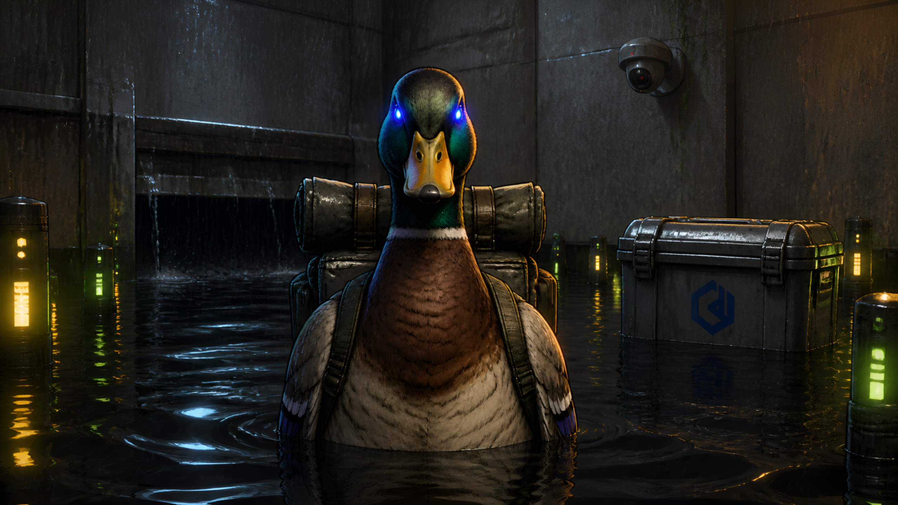
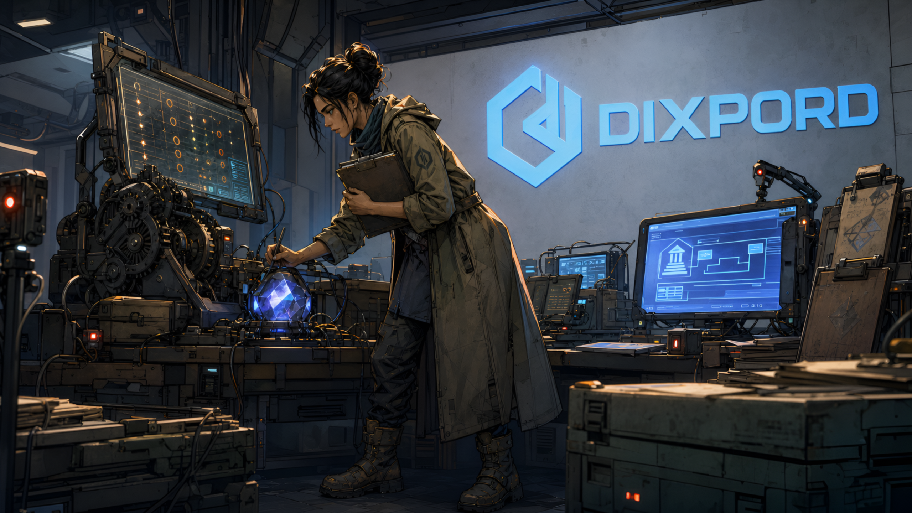

# 🦆👑 Crayon Lore

<div align="center">


[](https://python.org)
[](https://lmstudio.ai)
[](https://comfyanonymous.github.io/ComfyUI_examples/)
[](https://github.com/Kyutai-Labs/pocket-tts)
[](https://ffmpeg.org)

## ❤️ Support This Project

<a href="https://www.buymeacoffee.com/drgekoz" target="_blank"></a>



**An AI storytelling pipeline that narrates the backstory and lore of the Crayon Diet universe — the Union of the Peking Duck, the Duck Pope, Broccolini Biceps, Big Tony, Bro-Tech, Skibidi Sarah, Darrel the Time-Traveling Duck and more — as a cinematic, chaptered, animated story.** Feed it a pasted lore script (or an `.md` file), and it writes a story bible, plans a chaptered narration with character dialogue, renders a consistent animated cast, voice-clones the narrator and characters, composes a story-adaptive music bed, and uploads the finished episode to YouTube — headless.

[The Pipeline](#the-pipeline) · [Getting Started](#getting-started) · [Features](#features) · [Project Structure](#project-structure)

</div>

## 🎥 Example Output

<p align="center">
  <a href="https://www.youtube.com/@crayondiet">
    
  </a>
</p>

Episodes are narrated in the Crayon Diet debate-show universe — every one a chaptered origin story or how-they-met tale with a consistent cast, character-specific voice clones, burned-in chapter cards, and a full music bed.

| | |
|---|---|
|  |  |

> **Status:** runs **fully locally on an RTX 3070** (Krea 2 Turbo in ComfyUI, LM Studio, PocketTTS). No per-video cloud bills. The only paid external dependency is a **SerpAPI** key (brand logos + trend scoring, ~$0.01/query).

---

## What is Crayon Lore?

Crayon Lore is a **Split Node fork** specialised for **narrating the lore of the Crayon Diet universe**. You paste a block of lore text or point it at an `.md` file (the origin-story / how-they-met episodes), and the pipeline handles everything:

- a **story bible** with the real characters and factions from the lore
- a **chaptered narration script** (with natural, character-attributed dialogue)
- a **consistent animated cast** — the 5 Crayon Diet characters use their canonical bot images, and new characters (e.g. Darrel, Margaret) get a single generated portrait that is **persisted and reused in future episodes**
- **character-specific voice clones** — quoted dialogue is routed to each character's own voice (Duck Pope, Broccolini, Big Tony, Bro-Tech, Skibidi Sarah, plus Sassy / Bob the Builder / Cyclops Kanye when they match), with a gender-matched default PocketTTS voice for anyone without a clone
- a **story-adaptive music bed** — one Stable Audio 3 track per 2 narration paragraphs, LLM-written prompt ending in an explicit BPM, timed to the voice timeline
- **brand logos as full scenes** — e.g. the *Union of the Peking Duck* attaches the interior of the Sacred Church (with "Scan to Tithe" + Bitcoin and "The Duck Is Eternal" messaging) whenever it's mentioned
- **burned-in chapter cards** + typewriter location/person titles
- **automatic YouTube upload** + Discord announcement

Built for **content creators and automated channel operators** who want a character-consistent, cinematic AI lore storyteller — end to end — without touching a video editor.

> **I built this as a fully headless personal pipeline** — no UI, just `lore in → rendered and uploaded episode out`. Every stage is resume-safe.

---

## 🧠 How a small local model writes the whole story

Crayon Lore runs the entire LLM workload on a **small local model** in LM Studio. It never asks the model to hold the whole episode in its head at once — it **chunks the work and injects exactly the context each step needs**:

- **Paragraph injection (narration)** — each article/lore paragraph is expanded via a tight sliding window (`STORY CONTEXT` = that paragraph + its neighbours), so the model only ever holds a few paragraphs of source material. This scales to arbitrarily long episodes because the context window never grows.
- **Covered-beat dedupe** — each window gets an `ALREADY COVERED in earlier narration — do NOT repeat these beats` list so the small model never loops or repeats ideas.
- **Character dialogue** — the writer is told to include *attributed quoted speech* (e.g. `"Quack, and know peace," said the Duck Pope.`) so the pipeline can route each line to that character's own voice clone.
- **Focused single-purpose prompts** — bible, narration, shot list, chapter titles and brand extraction are each one scoped prompt with only the data they need.

The result: a small local model writes a full chaptered lore story — because the pipeline does the hard orchestration (chunking, windowing, deduping, voice routing) and the model is only ever asked to do one small, well-scoped creative task at a time.

---

## The Pipeline

Crayon Lore runs a step-by-step pipeline. Every stage is resume-safe — crash, restart, and it picks up exactly where it left off (it never re-uploads a finished video).

```
Lore input (.md / pasted text / URL)
    │
    ▼
┌──────────────────────────────────────────────┐
│ 1. SOURCE & TITLE                            │
│    pasted lore / .md file / URL              │
│    YouTube title taken from the .md header   │
│    (or LLM re-write? -> you choose verbatim) │
└──────────────────────────────────────────────┘
    │
    ▼
┌──────────────────────────────────────────────┐
│ 2. STORY BIBLE + SCRIPT                      │
│    locked bible (characters, factions, key   │
│    places) -> chaptered narration with       │
│    attributed dialogue -> shot list          │
└──────────────────────────────────────────────┘
    │
    ▼
┌──────────────────────────────────────────────┐
│ 3. CAST & CHARACTER REFS                     │
│    5 canonical Crayon Diet bot images +      │
│    one generated portrait per new character  │
│    (persisted to cast_refs/crayon_diet for   │
│    reuse across episodes)                    │
└──────────────────────────────────────────────┘
    │
    ▼
┌──────────────────────────────────────────────┐
│ 4. BRAND LOGOS (full scenes)                 │
│    Union of the Peking Duck, DIXPORD, etc.   │
│    church-interior / scene refs attached     │
│    whenever the brand is mentioned           │
└──────────────────────────────────────────────┘
    │
    ▼
┌──────────────────────────────────────────────┐
│ 5. VOICE & MUSIC                             │
│    character dialogue -> each speaker's own  │
│    voice clone (or gender-matched default)   │
│    story-adaptive SA3 bed: one track per 2   │
│    narration paragraphs (LLM prompt + BPM)   │
└──────────────────────────────────────────────┘
    │
    ▼
┌──────────────────────────────────────────────┐
│ 6. RENDER & TITLES                           │
│    Krea 2 shots + hevc_nvenc render          │
│    burned-in chapter cards + typewriter      │
│    location/person titles                    │
└──────────────────────────────────────────────┘
    │
    ▼
┌──────────────────────────────────────────────┐
│ 7. UPLOAD                                    │
│    YouTube (Crayon Diet channel, 'Crayon     │
│    Lore' playlist) + Discord announcement    │
└──────────────────────────────────────────────┘
```

---

## 💸 Run it for free on 8GB VRAM

- **Images are free and local.** Krea 2 Turbo runs in ComfyUI on a single RTX 3070 8GB card. The only cloud cost is SerpAPI (~$0.01/query) for brand logos / trend scoring.
- **The LLM is free and local.** LM Studio + a small local model writes the whole story.
- **Voice is free and local.** PocketTTS voice-clones the narrator and the characters on your own GPU.
- **Music, SFX and rendering are free and local.** A story-adaptive Stable Audio 3 bed, hit-aligned SFX, and FFmpeg `hevc_nvenc` output.

So a full episode costs **basically nothing**.

---

## Getting Started

### Prerequisites

- **Python 3.11+**
- **LM Studio** on `localhost:1234` (LLM + vision)
- **ComfyUI** with **Krea 2 Turbo** (default local backend — `comfy_manager.py` auto-starts it + downloads models)
- **PocketTTS** server on `127.0.0.1:8769`
- **FFmpeg** with `hevc_nvenc` (NVIDIA)
- *(optional, story-adaptive music)* **Stable Audio 3** via Pinokio — the resident medium model powers the per-2-paragraph music bed; falls back to the static music pool if unavailable
- A **SerpAPI** key for brand logos + trend scoring

### Install & Run

```bash
git clone https://github.com/DrGekoz/crayon-lore
cd crayon-lore

# Run the full pipeline (lore → upload)
CrayonLore.bat
# or
python crayon_lore.py
```

At the source prompt, paste a block of lore, a path to an `.md`/`.txt` file, or a URL. The pipeline then asks:

```
Do you want to re-write this using LLM? [Y/n]:
```

- **Enter / Y** — the LLM re-writes/expands the pasted lore into a chaptered narration.
- **n / no** — the pasted script is used **verbatim** as the narration (no rewrite, no generated intro); the structural pipeline still applies.

The video **title is taken from the `.md` file's header line** (e.g. `[Crayon Lore #001] - Origins of the Duck Pope - Part 1...`) and used exactly as-is — no LLM title generation.

### 🎬 YouTube auto-upload setup

When uploads are enabled, Crayon Lore auto-uploads every finished episode to the **Crayon Diet channel** on a new **Crayon Lore** playlist. The first time (or when the token expires) the pipeline asks for your **YouTube API secret `.json`** and prints the setup steps + link in the terminal. Full instructions are the same as Split Node's — see the *Getting Started → YouTube auto-upload setup* section of that repo, then run `python oauth_split_node.py` once to authorize.

### 🤖 Discord announcements (your own bot)

Crayon Lore can post a "new episode is live" announcement to any number of Discord servers/channels through a bot you own (self-contained, no deps — Discord REST API via the standard library):

```bash
python discord_bot.py --setup          # guided: token + pick servers/channels
python discord_bot.py --test           # verify the bot + all channels
python discord_bot.py --send "hi"      # test-send to ALL channels
```

Config lives in `.env` (never committed): `DISCORD_BOT_TOKEN` + `DISCORD_ANNOUNCE_CHANNELS` (comma-separated IDs, can span multiple servers).

### Common Commands

| Command | Purpose |
|---|---|
| `CrayonLore.bat` / `python crayon_lore.py` | Run the full pipeline (lore → upload) |
| `python crayon_lore.py --list-styles` | List every selectable style profile |
| `STYLE=arcane python crayon_lore.py` | Generate with a selected style profile |
| `RESOLUTION=4k python crayon_lore.py` | Render at 4K (default 1080p) |
| `python oauth_split_node.py` | YouTube OAuth authorization |
| `python discord_bot.py --setup` | Guided Discord bot + servers/channels setup |

---

## Project Structure

```
crayon-lore/
├── crayon_lore.py               Main pipeline script (all stages)
├── krea2_splitnode.py           Local Krea 2 Turbo image generation (ComfyUI)
├── providers.py                 Unified image/video backends: local, RunPod, fal.ai
├── comfy_manager.py             Auto-start ComfyUI, download models, run workflows
├── split_node_titles.py         Chapter / title ASS engine
├── oauth_split_node.py          YouTube OAuth authorization
├── discord_bot.py               Your own Discord bot + announcements (REST, no deps)
│
├── style_sheets/                Style profiles + custom_styles.json
├── cast_refs/                   Character likenesses + brand logos (gitignored)
│   └── crayon_diet/             Canonical bot images + persisted new-character refs
├── assets/ep001/                README showcase shots
├── cinematic_sounds/            SFX library
├── voice_refs/                  TTS narration + character voice-clone references
│
├── episodes/                    Per-episode folders (epN/) — gitignored
├── rendered_audio/              Generated narration — gitignored
├── rendered_video/              Rendered episodes — gitignored
└── thumbnails/                  Episode thumbnails — gitignored
```
