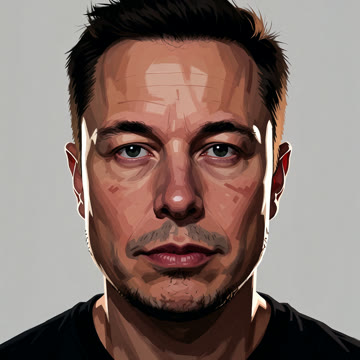
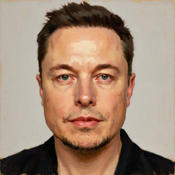
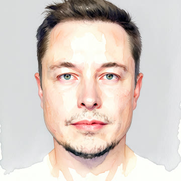

# 🎬 Split Node

<div align="center">


[](https://python.org)
[](https://lmstudio.ai)
[](https://comfyanonymous.github.io/ComfyUI_examples/)
[](https://github.com/Kyutai-Labs/pocket-tts)
[](https://ffmpeg.org)
[]()

## ❤️ Support This Project

<a href="https://www.buymeacoffee.com/drgekoz" target="_blank"></a>


**An AI documentary generator. Turns "beat the system" news stories (hacks, lottery wins, loopholes, scams) into ~25-minute cinematic documentaries in the FERN / Black Files style — with LLM-written narration, a consistent AI cast, stylized locations and props, voice-cloned narration, cinematic music and SFX, and burned-in chapter cards. Headless: RSS in, rendered and uploaded episode out.**

[The Pipeline](#the-pipeline) · [The Look](#-the-look) · [Supported Models](#supported-models--apis) · [Real-World Cost](#real-world-cost) · [Getting Started](#getting-started) · [Features](#features)

</div>

## 🎥 Example Output

<p align="center">
  <a href="https://github.com/DrGekoz/Split-Node-YouTube">
    
  </a>
</p>

Every episode is a full documentary: a locked story bible, an AI cast with consistent faces, stylized worlds, voice-cloned narration, music, SFX, and 10 duration-aligned chapters — rendered headless and uploaded automatically.

---

> **Status:** This pipeline runs **fully locally on an RTX 3070** (Krea 2 Turbo in ComfyUI, LM Studio, PocketTTS) — no per-video cloud bills. The only paid external dependency is a **SerpAPI** key for real-photo references and trend scoring (~$0.01/query). 1080p and 4K output.

---

## What is Split Node?

Split Node automates the entire documentary production workflow using AI. Feed it an RSS "beat the system" story (or a URL), and it handles everything: researching the story, building a director's bible, planning a ~25-minute narration script, writing a shot list with camera logic, generating a consistent AI cast with six identity-locked reference panels per character, building stylized locations and props, rendering every shot to 1080p or 4K, voice-cloning the narration, composing music, aligning SFX, burning in chapter cards, and uploading the finished episode to YouTube + Discord.

Built for **content creators, documentary-makers, and automated channel operators** who want to ship a cinematic, character-consistent AI documentary — end to end — without touching a video editor.

> **I built this as a fully headless personal pipeline** — no UI, just `RSS in → rendered and uploaded episode out`. Every stage is resume-safe, every image is face-locked and angle-aware, and every episode is written fresh from the article (no template reuse).

---

## 🧠 How a tiny local model writes the whole script

Split Node is deliberately engineered to do **all of the LLM work on a small local model** — it currently runs the entire pipeline on **Gemma 4 (7.5B) at a 12,222-token context window** in LM Studio. No giant context, no huge model, no cloud LLM bills. The secret is that the pipeline never asks the model to hold the whole episode in its head at once. Instead it **chunks the work and injects exactly the context each step needs** — so a 7.5B model comfortably produces a full ~25-minute documentary script, beat by beat.

Here's the injection architecture that makes that possible:

- **📰 RSS feed injection (story discovery)** — instead of asking the model "what should I make a video about?", the pipeline pulls *real* stories from RSS feeds (hacker / lottery / loophole / AI / tech) plus Hacker News Algolia search. Each candidate article is passed to the LLM to be **relevance-scored 0–10 against the niche**; off-topic beats are discarded before they ever reach the script stage. The model is never generating topics from thin air — it's *filtering and judging* curated input, which is far easier and cheaper than generating.

- **📃 Paragraph injection (narration script)** — the biggest win. The pipeline does **not** hand the model a full article and ask for a script. It splits the article into paragraphs and, for **each** paragraph, injects a tight sliding window (that paragraph plus its neighbours) as `STORY CONTEXT`, then asks for exactly N narration paragraphs. So at any moment the model only holds **~3 paragraphs of source material**, not a whole article. A 7.5B model easily expands a single paragraph into cinematic narration — and it scales to arbitrarily long episodes because the context window never grows.

- **🚫 Covered-beat dedupe injection** — alongside each window, the pipeline injects a short `ALREADY COVERED in earlier narration - do NOT repeat these beats` list (the last couple of beats it already wrote). This stops the small model from looping or repeating ideas across paragraphs, which is the classic failure mode of small-context generation.

- **🎨 CRITICAL style injection (images)** — every image prompt (shots, character panels, locations, props) gets the selected **style profile injected as a CRITICAL, non-negotiable requirement** — e.g. `arcane`, `noir`, `mannequin`, `roman-statue`, or your own custom descriptor. The prompt instructs the model in emphatic terms that the chosen style is **mandatory, overrides all other art direction, and must be applied to the entire frame** — so shots can't drop, dilute, or drift to a generic look. There are **no style image refs and no LoRA training**, so the visual look is driven by a single text string that any image model understands. That's what lets 10 built-in looks (plus unlimited custom ones) exist with zero retraining.

- **🎬 Prompt injection for everything else** — each LLM pass (director's bible, episode world, scene board, shot list, chapter titles, brand extraction) is a **focused single-purpose prompt** with only the data it needs. The shot list, for example, is built one beat at a time with camera logic injected as structured constraints (EWS/WS/MS/CU/ECU, angles, facing, SFX). No stage sees more context than it can chew.

The result: **a 7.5B local model writes the entire ~25-minute documentary script** — bible, narration, shot list, chapters — because the pipeline is doing the hard orchestration (chunking, windowing, deduping, scoring) and the model is only ever asked to do one small, well-scoped creative task at a time.

---

## 💸 Run it for free on 8GB VRAM

Here's the part that separates Split Node from the other "content machine" tools out there:

- **Images are 100% free and local.** Krea 2 Turbo (or Z-Image) runs in ComfyUI on a **single RTX 3070 8GB** card — no per-image cloud bill. Every shot, character panel, location and prop is generated on your own GPU. The only cloud cost in the whole image pipeline is **SerpAPI at ~$0.01/query** for real-photo references (and it's cached — logos from Wikimedia cost nothing, and real-photo refs are reused).
- **The LLM is free and local.** LM Studio + a 7.5B model on 12K context writes the entire script. No tokens, no API key, no rate limits.
- **Voice is free and local.** PocketTTS voice-clones the narrator on your own GPU (or use a built-in catalog voice).
- **Music, SFX and rendering are free and local.** A story-adaptive Stable Audio 3 music bed, 130+ hit-aligned SFX, and FFmpeg `hevc_nvenc` output to 1080p/4K — all on your machine.

So a full episode costs **basically nothing** — just the handful of SerpAPI queries for real-photo references (a few dollars worst case, often less).

**The only thing a low-end PC can't do locally is video generation.** AI image-to-video (Hailuo, Veo, Kling, LTX — via RunPod or fal.ai) needs a beefy GPU that most machines don't have. Split Node handles this gracefully: **on 8GB+ VRAM you can run the whole thing end-to-end for free**, and on a weaker PC the only external overhead is the optional video-clip step (~$0.23/clip via RunPod). You can even **skip AI video entirely** — Split Node's documentary style renders still shots with motion, music and SFX, so a fully cinematic episode still works without any video-generation API.

> **Bottom line:** one 8GB GPU = a completely free, self-contained documentary channel (images + script + voice + music + render + upload). The moment you add video generation, it's the *only* paid step — and it's optional. That's a lower overhead than any of the other "content machine" pipelines, most of which charge per image, per token, and per clip.

---

## The Pipeline

Split Node runs a step-by-step pipeline. Every stage is resume-safe — crash, restart, and it picks up exactly where it left off (it never re-uploads a finished video).

```
RSS / URL story
    │
    ▼
┌──────────────────────────────────────────────────────────┐
│  1. STORY DISCOVERY                                     │
│     RSS "beat the system" feed → article → junk filter   │
│     → LLM relevance scoring (0-10, off-topic discarded)  │
│     Trend scorer (SerpAPI + YouTube) ranks topic demand  │
└──────────────────────────────────────────────────────────┘
    │
    ▼
┌──────────────────────────────────────────────────────────┐
│  2. SCRIPT GENERATION (4 LLM passes)                     │
│     Director's bible → episode world → scene board        │
│     → narration script (length in minutes) → shot list  │
│     (EWS/WS/MS/CU/ECU + angles) + 10 chapter breaks      │
│     Human review gate on the Krea 2 test frame            │
└──────────────────────────────────────────────────────────┘
    │
    ▼
┌──────────────────────────────────────────────────────────┐
│  3. CAST & LIKENESS                                      │
│     20 metahuman archetypes; real-photo reference search  │
│     (SerpAPI + Openverse) + local vision audit            │
│     → SIX 1280x1280 identity panels per character         │
└──────────────────────────────────────────────────────────┘
    │
    ▼
┌──────────────────────────────────────────────────────────┐
│  4. LOCATIONS, PROPS & BRAND LOGOS                       │
│     6-panel location sheets per place · front+back props  │
│     Real brand logos (Wikimedia + SerpAPI) baked in       │
└──────────────────────────────────────────────────────────┘
    │
    ▼
┌──────────────────────────────────────────────────────────┐
│  5. FROM PANEL TO SCREEN                                 │
│     Per-shot smart ref selection (wide→body, close→face,  │
│     side→mirror, back→back) → Krea 2 render at 1080p/4K   │
│     in parallel with TTS                                  │
└──────────────────────────────────────────────────────────┘
    │
    ▼
┌──────────────────────────────────────────────────────────┐
│  6. VOICE, MUSIC & SFX                                   │
│     PocketTTS cloned narration (parallel) · story-adaptive│
│     Stable Audio 3 music bed (resident model, suspense→  │
│     triumphant, ducked) · 130+ hit-aligned SFX            │
│     · action-driven FOLEY (typing, driving, footsteps)    │
└──────────────────────────────────────────────────────────┘
    │
    ▼
┌──────────────────────────────────────────────────────────┐
│  7. RENDER & TITLES                                      │
│     hevc_nvenc concat · burned-in chapter cards           │
│     + typewriter location/person cards (ASS engine)       │
└──────────────────────────────────────────────────────────┘
    │
    ▼
┌──────────────────────────────────────────────────────────┐
│  8. UPLOAD                                              │
│     YouTube (native scheduling) + Discord announcement    │
└──────────────────────────────────────────────────────────┘
```

### 🧍 Visual Style

The default documentary aesthetic is **seamless glossy porcelain mannequins** — figures always fully clothed head-to-toe in complete period-accurate outfits including explicitly named footwear (e.g. "iron-buckled brown leather knee boots"), with **no visible joints, stands, or supports**. Photorealistic environments, ray tracing, cinematic lighting. It's a great starting point for YouTube-focused creators because it renders clean, consistent, license-safe characters without depicting realistic (possibly altered) human likenesses.

The look is **fully customisable** via selectable **style profiles** — each is just a plain-text descriptor injected into every prompt. Pick the `mannequin` style with `STYLE=mannequin`, swap to any of the other 8 built-in looks (`arcane`, `noir`, `watercolor`, ...), or add your own with `--add-style` (persists for every future run). In `mannequin` mode the porcelain face is fully prompt-controlled and the person's **hair** is fetched as *text* (web search → archetype fallback) and injected, so only that trait carries over from the real person — no image reference needed. See [🎨 The Look](#-the-look) below for the full gallery and all customization commands.

### 🎨 The Look

The channel style is a selectable **style profile** — a plain-text descriptor injected into every prompt (shots, character panels, locations, props). No style image refs, no LoRA training, no reference-copy bug.

Pick a built-in with the `STYLE` env var, or add your own:

```
STYLE=arcane python system_breakers.py          # default channel look
STYLE=bold-outline python system_breakers.py
STYLE=noir python system_breakers.py
python system_breakers.py --list-styles          # show every selectable style
python system_breakers.py --add-style vhs "<style descriptor text>"   # add + persist
python system_breakers.py --remove-style vhs     # remove a custom style
```

Built-ins: `arcane` (default), `bold-outline`, `artsy`, `photoreal`, `noir`, `synthwave`, `editorial`, `watercolor`, `mannequin`, `roman-statue`. Custom styles persist in `style_sheets/custom_styles.json` and become selectable on every future run. A resume keeps the exact style the episode was generated with (unless you override with `STYLE=`).

**See the look** — every built-in style, previewed on the same face (Elon Musk — real-photo identity ref + that style injected) so you can compare before you pick:

| 🎨 **Arcane** *(default)* | ✏️ **Bold outline** | 🎭 **Artsy** |
|---|---|---|
|  |  |  |

| 📷 **Photoreal** | 🌑 **Noir** | 🌆 **Synthwave** |
|---|---|---|
|  |  |  |

| 🗞️ **Editorial** | 🎨 **Watercolor** | 🧍 **Mannequin** |
|---|---|---|
|  |  |  |

| 🏛️ **Roman statue** |
|---|
|  |

> 🧍 **Mannequin look:** the mannequin style uses the **real-face method** — it takes the real person's photo as the single identity reference and renders a glossy **porcelain mannequin whose facial features match that person exactly** (bone structure, brow, nose, lips, jaw). The face reads as a polished museum mannequin resembling the person, *not* realistic human skin — coloured hair matches the reference. When no real photo is available it falls back to a text-hair injection. It's fully prompt-controlled and license-safe, so it renders clean, consistent characters without depicting altered human likenesses.

> 🏛️ **Roman statue look:** same real-face method, but rendered as a **classical ancient Roman marble statue** — the person's facial structure carved from smooth white Carrara marble (chiseled features, no skin/pores/stubble), sculpted marble hair matching the reference, draped in a classical toga. A museum-quality portrait-bust look that's equally license-safe and striking.

> 💡 **Want your own look?** The style is just plain text injected into every prompt — so add your own and it becomes a first-class option on every future run:
> ```
> python system_breakers.py --add-style vhs "grainy 90s VHS camcorder, scanlines, oversaturated, handheld"
> python system_breakers.py --list-styles     # 'vhs' now appears in the list
> STYLE=vhs python system_breakers.py          # and is selectable like the built-ins
> ```

---

## Supported Models & APIs

> **Note:** Split Node can render every image and video through **four interchangeable image backends** — local (ComfyUI), RunPod, fal.ai, or **Codex CLI** — selected per run with `IMAGE_BACKEND` / `VIDEO_BACKEND`. Defaults to fully local. Cloud backends need a `RUNPOD_API_KEY` / `FAL_API_KEY` in `.env`; the Codex backend uses your local **OpenAI Codex CLI** (GPT Image 2) and needs no API key.

| Selection | Values |
|---|---|
| `IMAGE_BACKEND` | `local` *(default)* · `runpod` · `fal` · `codex` |
| `IMAGE_MODEL` | see table below (per backend) |
| `VIDEO_BACKEND` | `runpod` · `fal` · `local` |
| `VIDEO_MODEL` | see table below (per backend) |
| `THUMBNAIL_BACKEND` | `fal` *(default)* · `local` · `runpod` · `codex` |
| `THUMBNAIL_MODEL` | `gpt-image-2` *(default, fal)* · `krea2-turbo` (local) · `z-image-turbo` (runpod) · `gpt-image-2` (codex) |

```bash
IMAGE_BACKEND=runpod python system_breakers.py        # shots via RunPod z-image-turbo
IMAGE_BACKEND=fal IMAGE_MODEL=flux-dev python system_breakers.py
VIDEO_BACKEND=runpod VIDEO_MODEL=veo3-1-fast python system_breakers.py
THUMBNAIL_BACKEND=local python system_breakers.py      # thumbnails on your GPU (free)
THUMBNAIL_BACKEND=fal THUMBNAIL_MODEL=gpt-image-2 python system_breakers.py  # default (best text)
IMAGE_BACKEND=codex python system_breakers.py           # shots/sheets via Codex CLI GPT Image 2
python providers.py --list-images   # show every image backend/model
python providers.py --list-videos   # show every video backend/model
```

> **Codex CLI backend** — if you have the **OpenAI Codex CLI** installed (`npm install -g @openai/codex`), set `IMAGE_BACKEND=codex` (or `THUMBNAIL_BACKEND=codex`) and every image — shots, character sheets, props, thumbnails — is generated by Codex's `/imagegen` (GPT Image 2), with **no API key needed**. The pipeline runs `codex exec --skip-git-repo-check '/imagegen <prompt>'`, grabs the newest PNG from `~/.codex/generated_images/`, then pipes it through ComfyUI's **FaceUpDAT upscaler** to reach the shot/panel/thumbnail resolution. If Codex CLI isn't installed, the backend reports it and you can fall back to another provider.

> **Note:** thumbnails default to **fal.ai GPT Image 2** (best text rendering for the "SPLIT NODE" + headline text). The pipeline **asks which thumbnail provider you want** at startup (1. local / 2. fal / 3. runpod / 4. codex) — or set `THUMBNAIL_BACKEND` / `THUMBNAIL_MODEL` to skip the prompt.

> **Note:** local rendering needs ComfyUI + the Krea 2 / Z-Image models. `comfy_manager.py` auto-starts ComfyUI and downloads any missing model files. Cloud backends ignore character/location ref panels (text-to-image) but need no local GPU.

### Image models

| Backend | Model | Notes |
|---|---|---|
| **local** *(ComfyUI)* | `krea2-turbo` *(default)*, `z-image-turbo` | Krea 2 Turbo FP8 + 4x-FaceUpDAT upscale; supports identity panels |
| **runpod** | `z-image-turbo` *(default)*, `nano-banana-2` (edit) | Serverless, async /run + poll; ~$0.005/image |
| **fal** | `flux-schnell` *(default)*, `flux-dev`, `nano-banana-2`, `z-image-turbo`, `gpt-image-2` | Sync /fal.run; ~$0.003–0.06/image |
| **codex** | `gpt-image-2` | Local Codex CLI `/imagegen` (GPT Image 2), no API key; output piped through FaceUpDAT upscale |

### Video models

| Backend | Model | Notes |
|---|---|---|
| **runpod** | `hailuo-02-std` *(default)*, `hailuo-2-3-fast`, `veo3-1-fast` (i2v), `p-video` | Serverless async; ~$0.23/clip |
| **fal** | `runway-gen3`, `veo3-1`, `minimax-hailuo` | Sync endpoint |
| **local** | `comfyui` | Requires a ComfyUI video workflow/model installed |

### LLM — Story, Scripts, Shot Lists, Metadata

| Provider | Models / Notes |
|---|---|
| **LM Studio** *(local)* | Any local model on `localhost:1234` (e.g. Gemma) — runs the director's bible, narration script, shot list, chapter titles, brand extraction, and relevance scoring |
| **Local vision** | Same LM Studio instance — audits real-photo references (person + text/logo/watermark) and extracts the style descriptor from style sheets |

### Image Generation

| Provider | Model | Notes |
|---|---|---|
| **ComfyUI** *(local)* | **Krea 2 Turbo** | Runs on RTX 3070 with `--lowvram`, 8-step Turbo at ~3s/it. Renders character panels, location sheets, props, brand assets, and every shot |
| **In-graph upscale** | **4x-FaceUpDAT** | Every panel/shot upscaled in-graph to the selected output resolution |
| **SerpAPI** *(cloud, ~$0.01/query)* | Google Images | Finds real-photo references for real-world subjects and specific props (Openverse fallback) |
| **Wikimedia Commons** | 36 pre-mapped brands | Official brand logos (rasterized PNG), no search needed |

### Voice / TTS

| Provider | Capability |
|---|---|
| **PocketTTS** *(local, CUDA)* | Cloned narration voice (built-in or a cloned `.wav` ref), loudnorm 0dB, generated in parallel with image generation |

### Music & SFX

| Provider | Capability |
|---|---|
| **Stable Audio 3** *(local, via Pinokio)* | **Story-adaptive** music bed — the resident medium model (loaded once in the SA3 Gradio UI) generates both bed sections (suspense → triumphant) through its `/generate` endpoint, so there's no per-episode model reload. Any section over 380s (6:20) is chunked into 6:20 segments + remainder, and the story/narration text is split proportionally across the chunks so each chunk's prompt reflects that story window. Music base `-10dB`, ducked to `-19.5dB` under the voice via sidechain compression (`MUSIC_BACKEND=sa3`, default). Falls back to the static pool if SA3 is unavailable |
| **Local** | One continuous music bed (suspense crossfading into triumphant) composed to fit the exact video length — fallback when SA3 isn't available |
| **SFX library** | 130+ cinematic sounds (Nikko Hunt) with pre-analyzed build/hit/decay times, hit-aligned at -14dB; camera shutter at -4dB |
| **Foley pipeline** | Auto-detects the **action** in each shot's scene text and beds the matching sound for the whole clip — typing → typewriter, driving → engine/traffic, walking → footsteps, rain → downpour, fire → crackle, boat → engine, and more |

> **SA3 startup port prompt (NEW):** SA3's Pinokio launcher opens on a **different localhost port each run** (7860, 7861, …), so before doing any pipeline work the script auto-scans ports 7860–7890 for a live SA3 Gradio UI (`detect_sa3_port`, socket probe + `/config` signature check). It then **asks you to confirm the port it found** — press Enter/Y to accept it, type a different port to override, or say no to enter it manually (blank to skip music), and uses that URL for the story-adaptive music bed. Set `SA3_GRADIO_URL` to skip the prompt, or `MUSIC_BACKEND=pool` to force the static-pool fallback.

### Video

| Provider | Capability |
|---|---|
| **FFmpeg** *(local)* | hevc_nvenc stream-copy concat, `+faststart`, 1080p or 4K; chapter cards + typewriter titles burned in via the ASS engine |

---

## Real-World Cost

> Because the heavy lifting runs **locally on your own GPU**, a full ~25-minute episode costs almost nothing — just the SerpAPI queries for real-photo references and the small YouTube API usage for upload.

| Component | Provider | Notes |
|---|---|---|
| Story + Scripts + Shot List | LM Studio (local) | Free |
| Images (panels, shots, upscale) | ComfyUI Krea 2 (local) | Free — GPU time only |
| Narration TTS | PocketTTS (local, CUDA) | Free |
| Music & SFX | Stable Audio 3 (local) + static-pool fallback | Free |
| Real-photo references + trend scoring | SerpAPI | ~$0.01/query (a few dollars per episode worst case) |
| Upload | YouTube Data API | Free quota |

**Tips to reduce cost:** run everything locally (already the default), and cache brand logos (Wikimedia) + real-photo refs so repeat searches never happen.

---

## Getting Started

### Prerequisites

- **Python 3.11+**
- **LM Studio** on `localhost:1234` (LLM + vision)
- **ComfyUI** with **Krea 2 Turbo** (default local backend — `comfy_manager.py` auto-starts it + downloads models)
- **PocketTTS** server on `127.0.0.1:8769`
- **FFmpeg** with `hevc_nvenc` (NVIDIA)
- *(optional, story-adaptive music)* **Stable Audio 3** via Pinokio at `F:/pinokio/api/stable-audio-3-small.pinokio.git` — the resident medium model powers the story-adaptive music bed. If unavailable, the pipeline falls back to the static music pool (`MUSIC_BACKEND=sa3` default)
- A **SerpAPI** key for real-photo references + trend scoring
- *(optional, cloud backends)* **RunPod** and/or **fal.ai** API keys for `IMAGE_BACKEND` / `VIDEO_BACKEND`

### 💾 Storage requirements (default local setup)

The default fully-local setup needs about **35 GB** free on your system drive
for the models + runtime. Breakdown of what the default install pulls down
(`comfy_manager.py` auto-downloads the image models; LM Studio + PocketTTS
install the rest):

| Component | Model / File | Size |
|---|---|---|
| ComfyUI image gen | `krea2_turbo_fp8.safetensors` | ~13 GB |
| ComfyUI image gen | `z-image-turbo-Q6_K.gguf` | ~5.6 GB |
| ComfyUI text encoder | `qwen3vl_4b_fp8_scaled.safetensors` | ~4.9 GB |
| ComfyUI text encoder | `Qwen3-4B-Q2_K.gguf` | ~1.6 GB |
| ComfyUI VAE | `qwen_image_vae.safetensors` | ~0.2 GB |
| **Image models subtotal** | *(ComfyUI models/ dir)* | **~25 GB** |
| LLM + vision (LM Studio) | Gemma 4 / 7.5B-class, Q4 | ~5 GB |
| TTS (PocketTTS) | cached voice model | ~0.5 GB |
| Runtime + repo | ComfyUI portable, FFmpeg, SFX library, voice refs | ~4–5 GB |
| **Total (approx)** | | **~35 GB** |

Notes:
- This is the **default local** footprint. Run image gen on the **cloud**
  (`IMAGE_BACKEND=runpod` or `=fal`) and you can skip the ~25 GB of ComfyUI
  image models entirely — your only local storage is the LLM, TTS and repo.
- **SSD strongly recommended** — the 13 GB Krea 2 UNET is streamed to VRAM on
  every image (`--lowvram`), so a slow drive makes generation noticeably slower.
- The exact `comfy_manager.py` download list lives in `MODEL_SOURCES`; run
  `python comfy_manager.py download-models` to fetch them.

### Install & Run

```bash
# Clone
git clone https://github.com/DrGekoz/Split-Node-YouTube
cd Split-Node-YouTube

# Set API keys in .env (never commit)
# SERPAPI_API_KEY=...

# Run the full pipeline (story → upload)
SystemBreakers.bat
# or
python system_breakers.py
```

### 🎬 YouTube auto-upload setup

When uploads are enabled, Split Node auto-uploads every finished episode to
YouTube. The first time you run it (or when your token expires) the pipeline
will ask you for your **YouTube API secret `.json`** — and print step-by-step
instructions + the link in the terminal log. The one-time setup:

1. **Get the secret `.json`** — open the Google Cloud Credentials page
   (the exact link is printed in the terminal during setup):
   <https://console.cloud.google.com/apis/credentials>
2. In "APIs & Services → Library", **enable the YouTube Data API v3**.
3. Click **+ CREATE CREDENTIALS → OAuth client ID → Desktop app**, name it,
   and **Create**.
4. Click the **DOWNLOAD** icon on that client — a `.json` file downloads.
5. **Save it into the Split Node project folder** as `client_secret_*.json`
   (keep the Google-generated name). The pipeline detects it automatically.
6. **Add the channel's email as a test user.** Until your Google Cloud project
   is verified, Google only lets *listed* test users authorize. Go to the
   project's **OAuth consent screen → "Test users"** → **+ Add users** and
   enter the **email address of the YouTube channel itself** (the account
   that owns the channel you upload to, e.g. your `@gmail.com`). Without this,
   the authorization URL will refuse to log in.
7. Run `python oauth_split_node.py` once — it prints an auth URL; open it,
   authorize with that same channel-owner account, and paste the code back.
   Credentials are saved to `~/.youtube-upload-credentials.json`.

After that, uploads are fully automatic. If the token later expires, the
pipeline refreshes it itself; only a re-authorization (step 7) is ever needed
manually.

### 🤖 Discord announcements setup (your own bot)

Split Node can post a "new episode is live" announcement to **any number of
Discord servers and channels** through a bot **you** create and own. Everything
is self-contained in this repo — no pip installs, no discord.py. It uses the
Discord REST API via the standard library.

The easiest way is the guided setup:

```bash
python discord_bot.py --setup          # guided: token + pick servers/channels
python discord_bot.py --test           # verify the bot + all channels
python discord_bot.py --list           # list configured announce channels
python discord_bot.py --remove <id>    # remove a channel
python discord_bot.py --send "hello"   # test-send to ALL channels
```

That's the same as running `python system_breakers.py --setup-discord`.

Manual steps:

1. **Create a bot** — open <https://discord.com/developers/applications>,
   click **New Application**, name it, then go to the **Bot** tab and click
   **Add Bot**.
2. **Copy the token** — under the Bot tab, click **Reset Token** / **Copy**.
3. **Invite it to your server** — the setup prints the invite URL (or use
   `https://discord.com/api/oauth2/authorize?client_id=YOUR_CLIENT_ID&permissions=3072&scope=bot`).
   It needs **Send Messages** + **View Channels** permissions. Invite it to as
   many servers as you like.
4. **Pick servers + channels** — the setup lists all your servers and lets you
   pick several servers and several channels at once (comma-separated numbers).
   Re-running `--setup` **adds** more channels — it never replaces what you've
   configured. The same bot token can post across all of them.

Config lives in `.env` (never committed):

```bash
# .env
DISCORD_BOT_TOKEN=your_bot_token_here
# Comma-separated IDs or #names - can span MULTIPLE servers:
DISCORD_ANNOUNCE_CHANNELS=123456789012345678,987654321098765432,#my-channel
# or just: DISCORD_CHANNEL=123456789012345678
```

When a video is uploaded, Split Node posts the announcement to **every
channel** in `DISCORD_ANNOUNCE_CHANNELS` — across all the servers you've added.
If no token/channel is configured, it skips the announcement gracefully (the
video still uploads to YouTube).

### Common Commands

| Command | Purpose |
|---|---|
| `python system_breakers.py --list-styles` | List every selectable style profile |
| `python system_breakers.py --add-style vhs "<desc>"` | Add a custom style (persists) |
| `STYLE=noir python system_breakers.py` | Generate with a selected style profile |
| `RESOLUTION=4k python system_breakers.py` | Render at 4K (image upscale + final video); default 1080p |
| `EASTER_EGG="duck pope" python system_breakers.py` | Hide an easter egg in one shot, no prompt |
| `python system_breakers.py --cache-logos OpenAI Claude` | Pre-cache brand logos without a full run |
| `python oauth_split_node.py` | YouTube OAuth authorization |
| `python discord_bot.py --setup` | Guided Discord bot + servers/channels setup (adds to existing) |
| `python discord_bot.py --test` | Verify the Discord bot + all channels |
| `python discord_bot.py --list` | List configured announce channels (with server names) |
| `python discord_bot.py --remove <id>` | Remove a channel from the announce list |
| `python discord_bot.py --send "hi"` | Test-send to ALL configured channels |

---

## Project Structure

```
split-node/
├── system_breakers.py          Main pipeline script (all 8 stages)
├── krea2_splitnode.py          Local Krea 2 Turbo image generation (ComfyUI)
├── providers.py                Unified image/video backends: local, RunPod, fal.ai
├── comfy_manager.py            Auto-start ComfyUI, download models, run workflows
├── cast_likeness.py            Build cast likeness references
├── split_node_titles.py        Chapter / title ASS engine
├── analyze_sfx.py              Analyze SFX library (build/hit/decay)
├── trend_scorer.py             Score topic ideas (demand/room/trajectory)
├── discord_bot.py               Your own Discord bot + announcements (REST, no deps)
├── upscale_4k.py               Optional standalone SPAN 4x upscaler
│
├── style_sheets/               Style profiles + custom_styles.json + easter_eggs.json
├── style_previews/             One 1280x1280 preview panel per selectable style
├── cast_refs/                  Cast likeness images (real/ + logos/ gitignored)
├── cinematic_sounds/           SFX library
├── docs/images/                README showcase images
├── voice_refs/                 TTS narration voice clone reference
│
├── shots/                      Per-episode shot folders (epN/) — gitignored
├── rendered_audio/             Generated narration — gitignored
├── rendered_video/             Rendered episodes — gitignored
└── thumbnails/                 Episode thumbnails — gitignored
```

---

## Features

### Story Discovery
- **Custom article URL** — at startup you can **paste your own article URL** (press Enter for RSS, or type/paste any `http(s)` link). The pipeline fetches that article directly, skips RSS entirely, and runs the full script/image/render/upload pipeline on it
- **RSS "beat the system" ingestion** — hack / lottery / loophole keywords with junk-article filtering (cookie, newsletter, paywall, sponsored, boilerplate stripped before paragraph extraction)
- **Recency-first selection** — candidate articles are sorted **most recent first** (matching the filters), so fresh stories surface before older ones instead of the same few looping
- **Rejection cooldown** — if you say **no** to an article, it's recorded and **not re-presented for 7 days** (`REJECT_COOLDOWN_DAYS`), so rejected links stop repeating every run; used articles are never re-shown
- **Story resolve-and-retry** — every candidate is **parsed before it's presented**: `_pick_story` fetches + extracts each link up front, and a link that's blocked / dead / paywalled / empty is **auto-skipped** (no prompt) and you're offered the next working story — you only ever see links that actually resolve (`STORY_RESOLVE_ATTEMPTS`, default 5)
- **LLM relevance scoring** — every paragraph scored 0-10 vs the topic; off-topic beats discarded (fail-open keep-on-error)
- **Trend scoring toolkit** — SerpAPI demand + YouTube competition analysis to pick topics with actual demand (cached 24h)

### Script Generation
- **Story bible (NEW) — built from the article BEFORE the script** (FERN + Isaac framework): locks the visual hook (the thing the viewer must SEE), the deeper question the episode answers, surface + deeper problem, the protagonist's transformation arc, hero's-journey beats, and the **REAL character roster** extracted from the article (with per-character best-guess **gender + age** inferred from the article). The narration script is then written to **follow this bible**, and the shot list may only use those exact character names — so every episode is written fresh from its own story (no template reuse, no leaked names from a previous episode). The bible **retries up to 3×** on an empty/incomplete result so a transient LM timeout can never silently disable the roster lock
- **Establishing shots (NEW)** — before the first paragraph that mentions each unique **location** or **character**, a dedicated establishing shot is injected (wide/full frame: EWS for a place, WS full-body for a person). On first introduction the camera **shutter fires and the video instantly cuts to that establishing frame** before entering the scene. Ages drive the cast: a "23-year-old man" and a "retired 70-year-old" now get DIFFERENT archetypes via numeric-age matching, never both collapsing to mid-40s
- **Director's bible** — before any image is made: deeper problem, transformation arc, chapter moods, hero paragraphs for ECU magnification
- **Episode world** — works for any topic / environment / location
- **Scene board** — one storyboard card per narration beat, saved to the episode folder for human review
- **Stage 1 — narration script** — you pick the **video length in minutes**, and the pipeline works backwards (at ~14.3s per paragraph) to the target narration-paragraph count; each article paragraph is written into narration with covered-beat dedupe and a strict OUTPUT CONTRACT. A **deterministic pacing pass** then splits overlong sentences at clause boundaries and breaks monotone length-runs so the voice reads with natural rhythm. **Length cap (NEW):** the script now writes at most **1 narration paragraph per source article paragraph** (no expansion blowup), and each paragraph is capped at **2 sentences per article sentence** (and never more than the global 4-sentence cap) — so the narration stays tight and never repeats beats or balloons past the requested length
- **Deterministic pacing gaps** — per-shot silence pauses computed in code (chapter 1.6s, question 1.2s, reveal 1.0s, hero 0.9s, place anchor 0.7s, default 0.4s) are applied to the audio mix so the narration breathes where the story needs it — no LLM involved
- **Stage 2 — shot list** — every narration paragraph gets a shot entry: character archetype, camera logic (EWS/WS/MS/CU/ECU), angle, action, facing, SFX category
- **10 chapter breaks** — duration-aligned from word counts, LLM-written titles
- **FERN-style title & description** — written from the bible's visual hook + deeper question; tags, chapter timecodes and the Discord link unchanged
- **Style test frame** — a Krea 2 test frame is generated and human-reviewed before the run commits

### Cast & Likeness
- **20 metahuman archetypes** with exact clothing prompts; role / gender / age matching with everyman fallback. **Bible-driven age/gender** now overrides role-keyword sniffing via **numeric-age matching** (a "23-year-old man" renders young, never elderly; a retiree renders old), and multi-person shots split into one sheet per character. **Props & location sheets are OFF by default** — only the 6 character panels + establishing shots are generated (`LOCATION_SHEETS` / `PROP_SHEETS` = 1 to re-enable)
- **Deterministic `[CAST-LOCK]`** — after the LLM writes the shot list, every character field is hard-filtered so only the story bible's REAL roster (or `NONE`) survives; any hallucinated or cross-episode-leaked name is dropped, killing the 'Stefan Mandel' style contamination for good
- **Real-photo reference search** (SerpAPI + Openverse) with local vision audit (person + text/logo/watermark checks) and **image-decode validation** — cached refs and downloads that turn out to be HTML redirects/error pages are discarded and re-fetched, so a bad ref can't crash the face panel. The audit **only rejects on an explicit NO** (an uncertain/`?` vision response is accepted best-effort so a real ref isn't thrown away), known-bad CDNs (Instagram widget, TikTok API, gstatic/YouTube thumbs) are skipped before download, candidate count is capped (`REALREF_MAX_CANDIDATES`, default 12), and a "no ref found" result is cached so the search isn't re-burned every run
- **Six individual 1280x1280 identity panels** per character (face, face-side, face-back, body-front, body-side, body-back) — no grid merge
- **Anti-duplicate figure fix** — character panels and single-character shots pass a `NO_DUPLICATE_NEGATIVE` prompt (bans "two people, duplicate, clone, mirror image, split body...") on top of `grounding_px=768`, so the side/back views never render two bodies. Krea2 takes up to **8 identity refs** at once for multi-person shots
- **Smart per-shot ref selection** — wide shot → body panel, close-up → face panel, facing left → side panel as-is, facing right → side panel MIRRORED, back → back panel, hand/object close-up → no person ref, multi-person → one panel per character
- **Panels-first generation** — every character's six identity panels are built in a **dedicated pass before any shot renders** (in both fresh and resume runs), with face-panel failure retries, so a ComfyUI hiccup can't cascade into every shot missing a face

### Style & Look
- **Selectable style profiles** — 10 built-ins (incl. `mannequin`, `roman-statue`) + unlimited custom styles, injected as text into every prompt (no style-plate refs, no reference-copy bug)
- **Style previews** — one preview panel per style so you can compare before you pick
- **Locations & props** — 6-panel location sheets per environment (establishing / front-left / front-right / interior / detail / overhead), front+back prop assets

### Brand & AI Logos
- **Official source first** — 36 brands pre-mapped to Wikimedia Commons logos (rasterized PNG); SerpAPI only for brands not in the registry
- **Context-aware rendering** — entity talk → hacker-style computer screen with the real logo; HQ talk → logo on a glowing building facade; business-building locations get the logo baked into their sheet
- **Cache-first** — logos downloaded once, reused forever, zero repeat searches

### Rendering
- **Four interchangeable image backends** — every image renders via local ComfyUI, RunPod, fal.ai, or Codex CLI, selected with `IMAGE_BACKEND` / `THUMBNAIL_BACKEND` (defaults to local). `providers.py` routes each call; `comfy_manager.py` auto-starts ComfyUI and downloads missing models
- **Local Krea 2 Turbo** (RTX 3070, `--lowvram`) with in-graph 4x-FaceUpDAT upscale
- **1080p or 4K output** — `RESOLUTION` env var or startup prompt; drives both image upscale and video output, persisted to resume state
- **Chapter cards + typewriter titles** — Bahnschrift glow-pop chapter cards, Consolas typewriter location/person cards, pinned to faster-whisper word timings
- **Music & SFX** — **story-adaptive Stable Audio 3 music bed** (resident medium model, suspense → triumphant, base -10dB ducked to -19.5dB under the voice), 130+ hit-aligned SFX

### 🥚 Easter Eggs
- **One hidden element in exactly one shot** per episode — subtle, easy to miss. Pick from the list or write your own (`--add-easter-egg`)
- Built-in: **Duck Pope** — Pontiff of the Union of the Peking Duck — a tiny ancient majestic sacred white duck in papal regalia, hidden far-background and out of focus
- The exact timecode of the hidden shot is reported after render AND after upload

### Reliability & Automation
- **Resume-safe** — every stage skips already-completed work, persistent batch clips; a crash rebuilds the episode world, not just the images. At startup (fresh and on resume) the pipeline **asks which style profile to use** and **whether to resume image generation or re-generate everything** (R/e, or `REGEN_IMAGES=1` to force overwrite). Picking a style **different from the current/resume style automatically forces a full re-generate** so the new look actually applies — otherwise it keeps the shots you like
- **Crash-resilient image gen** — retry wrapper with ComfyUI recovery (polls `/system_stats` up to 240s), ref re-encode, 4 crash-retries per image
- **tqdm progress bars** with per-item ETA on every stage

### 📦 YouTube metadata & publishing
- **Chapterizing** — the ~10 chapter breaks are written by the LLM, pinned to **faster-whisper word timings**, and burned into the video as **Bahnschrift** chapter cards on a solid black backdrop that lasts only as long as the narrator reads the chapter title. On upload they're also written into the description as **YouTube chapter timestamps** (`00:00 …`, `02:15 …`) so viewers get an auto chaptered playback bar
- **Title generation** — 3 clickbait titles scored against Google Trends + YouTube competition; each under 70 chars, curiosity-gap driven (the public YouTube titles no longer carry the `#NNN -` episode-number prefix — the number stays internal to folders, filenames, resume state and descriptions)
- **Description generation** — the LLM writes a full SEO description, then the chapter timestamps are appended; the Discord invite pitch is stripped for the in-app announcement
- **Tag generation** — 12 LLM-generated topic tags merged with the channel's persistent base tags
- **Thumbnail generation** — a clickbait headline + "SPLIT NODE" branding rendered by your chosen provider (default fal.ai GPT Image 2 for crisp text; local ComfyUI or RunPod selectable). The pipeline **asks which thumbnail provider** at startup, and the prompt now explicitly forbids rendering stray channel names/logos/watermarks (so 'FERN' never gets baked into the image)
- **Upload** — native scheduling, per-channel credentials, AI-generated content disclaimer, then a Discord announcement (multi-server/multi-channel)

---

## Contributing

Feel free to open a PR! Areas that would benefit most from contributions:

- **New style profiles** — add more built-in visual styles
- **New easter eggs** — expand the hidden-element library
- **Model swapping** — alternative local LLM / image / TTS backends
- **New SFX** — expanding the cinematic sound library
- **Bug fixes & polish** — anything you find while using it

---

## License

Private project — © 2026 DrGekoz (AdsDoctorMelbourne). All rights reserved. See [Buy Me a Coffee](https://www.buymeacoffee.com/drgekoz) for support.

---

[](https://github.com/DrGekoz/Split-Node-YouTube)
